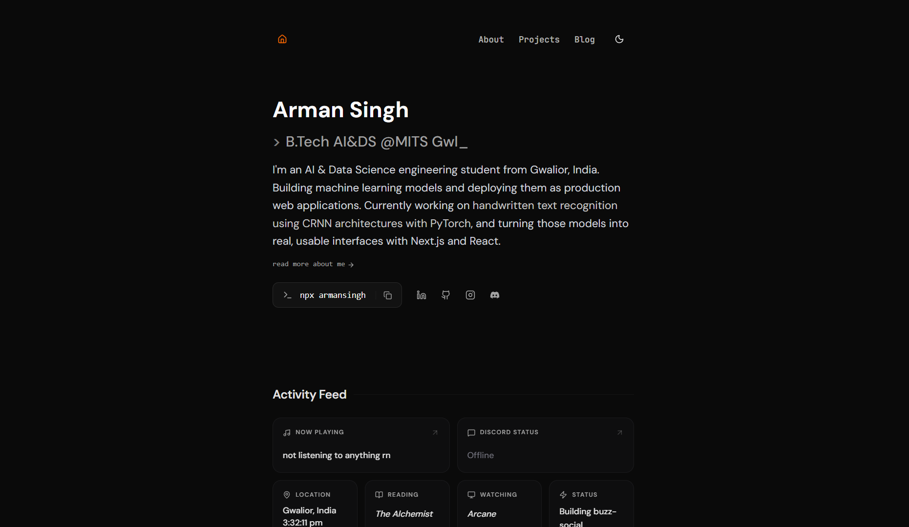

# armansingh.me

my personal portfolio — built with Next.js 16, TypeScript, and Tailwind CSS v4.

**Live:** [armansingh.me](https://armansingh.me) &nbsp;|&nbsp; **GitHub:** [armansinghh](https://github.com/armansinghh)



---

## What's in it

- **Activity Feed** - real-time Spotify, Discord status, GitHub commits, location, what I'm reading/watching
- **Blog** - powered by Notion, rendered with `react-notion-x`
- **Projects** - grid with modals + dedicated static pages (for SEO, the modals stay)
- **Dynamic OG Images** - per-page Open Graph images via `@vercel/og`
- **Meowl 😾** - pixel-art cat that follows your cursor. toggleable from the activity feed
- **Custom Cursor** - gooey multi-dot cursor effect, desktop only
- **Dark / Light Theme** - system-aware, no flash, via `next-themes`
- **Contact Form** - sends to Discord webhook, honeypot spam protection + rate limiting
- **SEO** - per-page metadata, schema markup (ProfilePage, SoftwareApplication, BlogPosting, FAQPage), sitemap, canonical URLs
- **GitHub Contribution Graph** - custom style, generated from GitHub Actions
- **PWA Ready** - manifest + correct icon sizes

---

## Stack

| | |
|---|---|
| Framework | Next.js 16 (App Router) |
| Language | TypeScript |
| Styling | Tailwind CSS v4, shadcn/ui |
| Fonts | DM Sans, JetBrains Mono, Geist (local) |
| Animations | Framer Motion, tw-animate-css |
| Blog CMS | Notion API + react-notion-x |
| Data Fetching | SWR |
| Forms | react-hook-form + Zod |
| Icons | Lucide React, React Icons |
| OG Images | @vercel/og |
| Deployment | Vercel |

---

## Structure

```
src/
├── app/
│   ├── page.tsx                  # Home
│   ├── about/
│   ├── projects/
│   │   └── [slug]/               # Static project pages (SEO)
│   ├── blog/
│   │   └── [slug]/               # Individual blog posts
│   └── api/
│       ├── og/                   # Dynamic OG image generation
│       ├── commits/              # GitHub recent commits
│       ├── get-discord-status/   # Lanyard Discord presence
│       └── send-message/         # Contact form → Discord webhook
├── components/
│   ├── activities/               # Spotify, Discord, GitHub, Location widgets
│   ├── about/                    # TechStack, TechGroup, AboutContent
│   ├── blog/                     # Notion renderer, BlogListContent
│   ├── home/                     # HomeContent, CopyCommandButton
│   ├── projects/                 # ProjectGrid, ProjectCard, ProjectModal
│   ├── shared/
│   │   ├── layout/               # Navbar, Footer, ThemeSwitch
│   │   ├── Meowl/                # pixel-art cat
│   │   ├── modals/               # NowPlaying, Discord, Commit modals
│   │   ├── contact/              # MessageBox (Discord webhook form)
│   │   └── providers/            # Theme, GlobalModal, Tooltip providers
│   └── ui/                       # shadcn/ui primitives, CustomCursor, BentoCard
├── data/
│   ├── activity.ts               # reading, watching, status, location
│   ├── home.ts                   # typewriter strings, socials, npx command
│   ├── about.ts                  # intro, education, interests
│   ├── metadata.ts               # site-wide SEO metadata
│   ├── projects.ts               # projects array
│   └── techstack.tsx             # tech stack with icons
├── hooks/
│   └── useNowPlaying.ts          # Spotify polling hook
├── lib/
│   ├── notion.ts                 # Notion API helpers
│   ├── ProjectStatus.ts          # status badge config
│   └── utils.ts                  # cn() helper
└── styles/
    └── globals.css               # global styles, CSS variables, Notion overrides
```

---

## Getting Started

**Prerequisites** — Node.js `>= 20.9.0`, a Notion account for the blog

```bash
git clone https://github.com/armansinghh/portfolio.git
cd portfolio
npm install
```

create `.env.local`:

```env
# Notion
NOTION_API_KEY=your_notion_integration_token
NOTION_BLOG_DATABASE_ID=your_notion_database_id

# GitHub (optional — increases rate limit)
GITHUB_TOKEN=your_github_pat

# Discord webhook for contact form
DISCORD_WEBHOOK_URL=https://discord.com/api/webhooks/...
```

```bash
npm run dev
```

---

## Notion Blog Setup

| Property | Type | Notes |
|---|---|---|
| `Title` | Title | post title |
| `Slug` | Rich Text | URL slug e.g. `my-first-post` |
| `Description` | Rich Text | short summary |
| `Date` | Date | publish date |
| `Tags` | Multi-select | post tags |
| `Published` | Checkbox | must be `true` to show |
| `Author` | People | author name |

---

## Customization

| what | where |
|---|---|
| activity (reading, watching, status) | `src/data/activity.ts` |
| home page copy + socials | `src/data/home.ts` |
| about page content | `src/data/about.ts` |
| site-wide SEO metadata | `src/data/metadata.ts` |
| projects | `src/data/projects.ts` |
| tech stack | `src/data/techstack.tsx` |
| theme colors | `src/styles/globals.css` |
| meowl toggle | activity feed card or `meowl-enabled` in localStorage |

---

## Credits

design inspired by [Manpreet Singh](https://github.com/MannuVilasara). thanks for putting your work out there.

---

## License

MIT (use it as inspiration, just don't deploy it with my info ✌️) 

---

<p align="center">Built with ❤️ by <a href="https://armansingh.vercel.app">Arman Singh</a></p>